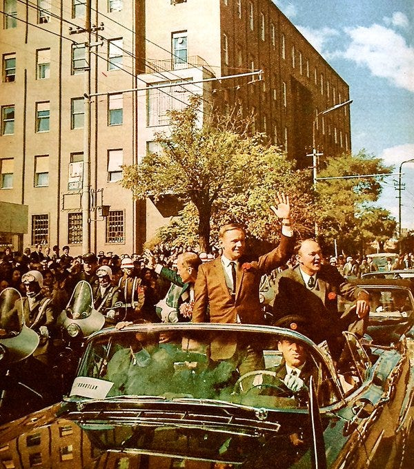
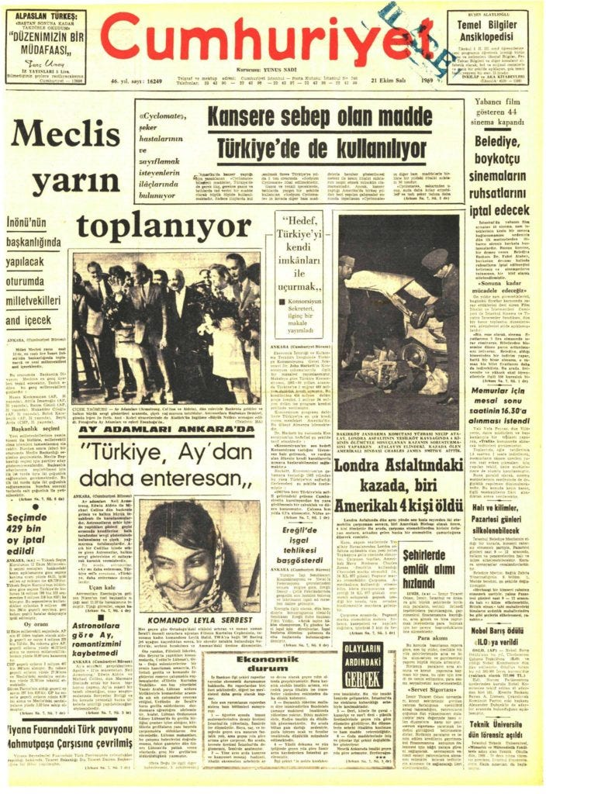

Tarih: 21 Temmuz 1969. Tüm dünya, televizyonlara ve radyolara kilitlenmiş bir şekilde tarihi bir olaya tanıklık ediyorlar. Neil Armstrong Ay örümceğinin merdiveninde Ay’a ayak basmak için hazırlanıyor. Ve o tarihi söz geliyor. “one small step for a man, one giant leap for mankind.“(bir insan için küçük, insanlık için büyük bir adım.) Ay’a iniş sadece bir ırkın değil tüm Dünya’nın bir başarısıdır. Arsev Eraslan, İsmail Akbay, Dilhan Eryurt isimli 3 bilim insanımızın da içinde bulunduğu, binlerce önemli kişiden oluşan ekibin başarısıdır. Bu tarihi adımdan sonra Apollo 11 mürettebatı; Neil Armstrong, Buzz Aldrin, Michael Collins bir Dünya turu düzenlediler. Bu tur kapsamında Türkiye’ye de geldiler. 20 Ekim 1969 tarihinde Richard Nixon’nın özel uçağı ile Ankara’ya iniş yaptılar. Cadillac marka araçla Ankara halkını selamladılar.

<figure>

<figcaption>Ankara halkını selamlarken</figcaption>
</figure>

Ankara’ya gelmelerindeki sebep Türkiye Cumhuriyeti Kurucusu Mustafa Kemal Atatürk’ün huzuruna ziyaret gerçekleştirmekti. Anıtkabir’e geldiler ve mozoleye bir çelenk bırakarak Atatürk’e olan saygılarını gösterdiler. Binlerce kilometre uzaklıktaki insanların duyduğu saygıyı; maalesef ülkemizde göremiyoruz, bizler için içler acısı bir durum. Gezinin sonunda dönemin Başbakanı Süleyman Demirel astronotlara Nutuk kitabını hediye etti. Dönemin gazetelerine bakılırsa astronotların: “Türkiye Ay’dan daha ilginç.” yorumu yüzleri gülümsetiyor.

41 yıl sonra, 2010 yılında ikinci bir ziyaret daha gerçekleştirildi. Bu sefer Adana Çukurova Üniversitesi’nde Neil Armstrong, Jim Lovell ve Gene Cernan isimlerinin içinde bulunduğu bir konferans düzenlendi. Akabinde aklıma şu soru geliyor: Bir daha ne zaman oraya gideceğiz?
